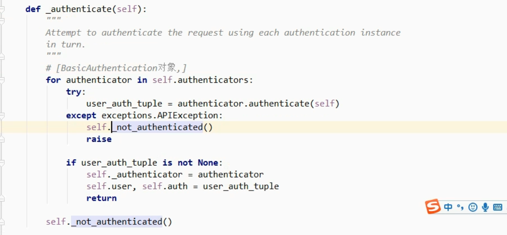

#### rest framework框架之认证使用和源码执行流程

a. 认证

~~~python
#  仅使用：
from django.views import View
from rest_framework.views import APIView
from rest_framework.authentication import BasicAuthentication
from rest_framework import exceptions
from rest_framework.request import Request

class MyAuthentication(object):
    def authenticate(self,request):
        # request._request 为原始的 request
        token = request._request.GET.get('token')
        # 获取token校验
        if not token:
            raise exceptions.AuthenticationFailed('用户认证失败')
        return ("alex",None)

    # 认证失败时执行
	def authenticate_header(self,val):
		pass

class DogView(APIView):
    # 自定义认证类
    authentication_classes = [MyAuthentication,]

    def get(self,request,*args,**kwargs):
        print(request)
        print(request.user)
        ret  = {
            'code':1000,
            'msg':'xxx'
        }
        return HttpResponse(json.dumps(ret),status=201)
~~~

源码流程：

~~~python
丰富request: dispatch -> initialize_request -> Request(
	request,  # 原始 request
	...
	get_authenticators() -> authentication_classes
)
~~~

~~~python
# 检查是否 认证 (源码流程)
dispatch -> initial() -> perform_authentication() -> request.user [Request类中] -> _authentication() -> self.authenticators -> authentication(self) [认证类的authentication()方法]
~~~

