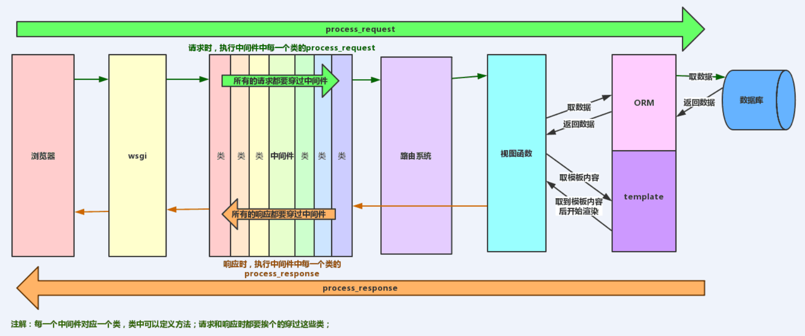

#### Django框架请求生命周期及wsgi

###### 请求生命周期

~~~
* wsgi, 它就是socket服务端，用于接收用户请求并将请求进行初次封装，然后将请求交给web框架(Flask,Django)
* 中间件，帮助我们对请求进行校验或在请求对象中添加其他相关数据，例如：csrf,request.session
* 路由匹配
* 视图(视图函数、视图类)，在视图函数中进行业务逻辑的处理，可能涉及到：orm、templates->渲染
* 中间件，对相应的数据进行处理
* wsgi,将响应的内容发送给浏览器
~~~

###### 什么是wsgi

~~~
web服务网关接口

实现该协议的模块：
- wsgiref
- werkzurg
- uwsgi

wsgi，是协议。
wsgiref，是实现了wsgi协议的一个模块。模块本质：一个socket服务端。（Django）
werkzeug ，是实现了wsgi协议的一个模块。模块本质：一个socket服务端（Flask框架）
tornado ，是实现了wsgi协议的一个模块。模块本质：一个socket服务端（Flask框架）
uwsgi，是实现了wsgi协议的一个模块。模块本质：一个socket服务端。
~~~

###### wsgi 实现

~~~python
def application(environ, start_response):
    start_response('200 OK', [('Content-Type', 'text/plain')])
    return ['This is a python application!']
 

if __name__ == '__main__':
    from wsgiref.simple_server import make_server
    
    server = make_server('0.0.0.0', 8080, application)
    server.serve_forever()
~~~

###### 视图

~~~
FBV
CBV

FBV与CBV本质是一样的，只是FBV基于函数，CBV基于类。只不过FBV较CBV往后多执行了几步。
~~~

###### rest-framework

~~~
rest-framework 从 dispatch 方法开始介入，执行完视图。
~~~

