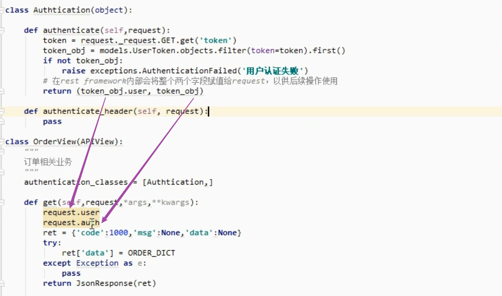
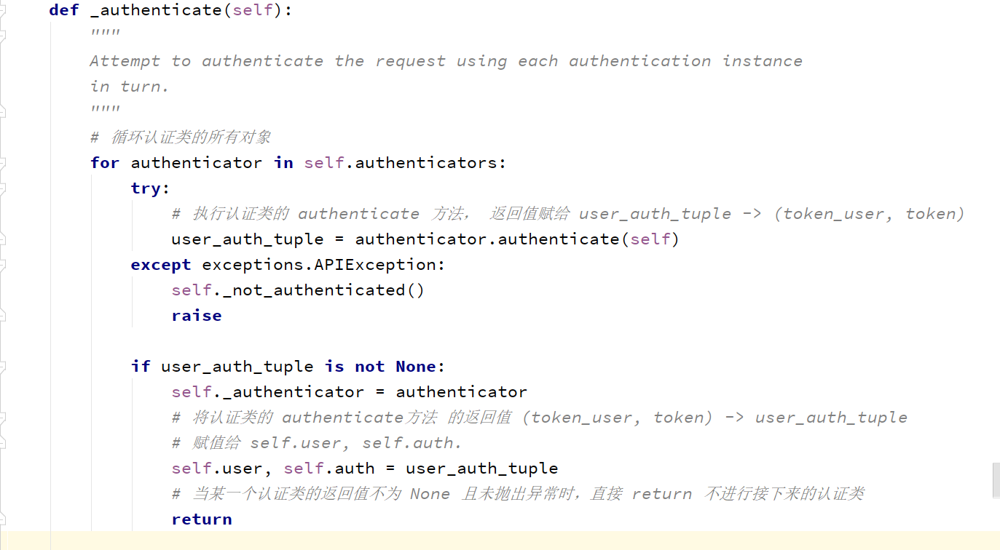
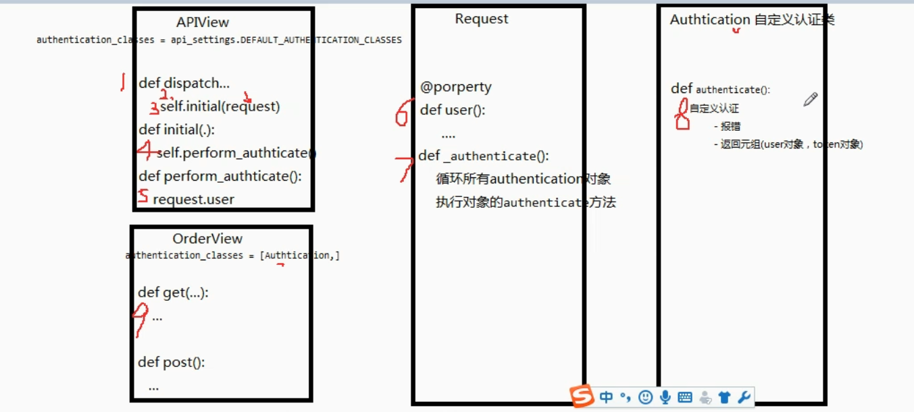

### 基于token局部认证及认证返回值 (authentication_classesd)

#### 认证

###### 基于authentication_classesd的认证失败 异常捕获

~~~python
# 认证失败 异常捕获路径 (此时还未反射)

dispatch() -> self.handle_exception(exc)
~~~

###### 基于authentication_classesd的认证配置

~~~python
# 路径 (drf 配置文件路径)
dispatch() -> initialize_request() -> get_authenticators() -> authentication_classes

# 当认证失败时，通过 下图Authtication(认证类)中的 raise 抛出异常，并由 self.handle_exception(exc) 捕获

# authentication_classes 不宜添加多个认证类
~~~

#### 认证返回值

###### 上图中紫色箭头逻辑分析

###### 自定义认证类的三种返回值情况

~~~python
# 返回 None (pass)
表示该认证不处理，交给下一个认证类处理

#  raise 抛出异常
认证失败，不进行接下来的其他认证类，直接由  self._not_authenticated() 捕获异常

# 返回格式固定的 (request.user, request.auth) -> 即[图一]中的 (token_user, token)
表示验证通过，不进行接下来的其他认证类 [见图二]
在视图中可以调用 request.user, request.auth  # 注意此处的 request.user 为 User实例对象

# 特殊...
当所有的认证类返回None时(pass)，执行 self._not_authenticated() 将 (request.user, request.auth) =[赋值为] (AnonymousUser,None), 即为匿名用户
~~~

#### 认证源码流程

