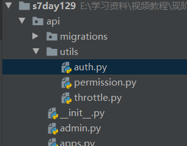

### 基于token的全局认证配置及匿名用户配置 (authentication_classesd)

~~~ 
局部视图使用&全局使用
~~~

###### 项目目录结构

#### 配置全局token认证 及 解除单个视图认证

~~~python
REST_FRAMEWORK = {
    # 全局使用的认证类 -> 认证类(最好放到单独的py文件中)
    "DEFAULT_AUTHENTICATION_CLASSES": ['api.utils.auth.FirstAuthtication', 'api.utils.auth.Authtication',],
}

# 解除对某个视图的认证
authentication_classes = []
或 
def authenticate(self, request):
    pass

def authenticate_header(self, request):
    pass
~~~

#### 匿名用户配置

~~~python
# 为什么是 REST_FRAMEWORK 这个单词呢？ (可不看)
# 源码路径
dispatch() -> initialize_request() -> get_authenticators() -> authentication_classes -> api_settings -> reload_api_settings() 
~~~

~~~python
REST_FRAMEWORK = {
    # user
    # "UNAUTHENTICATED_USER":lambda :"匿名用户",   # request.user = "匿名用户"
	# token
    # "UNAUTHENTICATED_TOKEN": lambda: "匿名auth",   # request.auth = "匿名auth"
    # ----------
    # user
    "UNAUTHENTICATED_USER": None,  # 匿名，request.user = None
    # token
    "UNAUTHENTICATED_TOKEN": None,  # 匿名，request.auth = None
}

# 源码逻辑分析路径
self.dispatch() -> initial() -> perform_authentication() -> request.user -> user(self) -> _authenticate() -> _not_authenticated() -> api_settings.UNAUTHENTICATED_USER 和 api_settings.UNAUTHENTICATED_TOKEN
~~~

