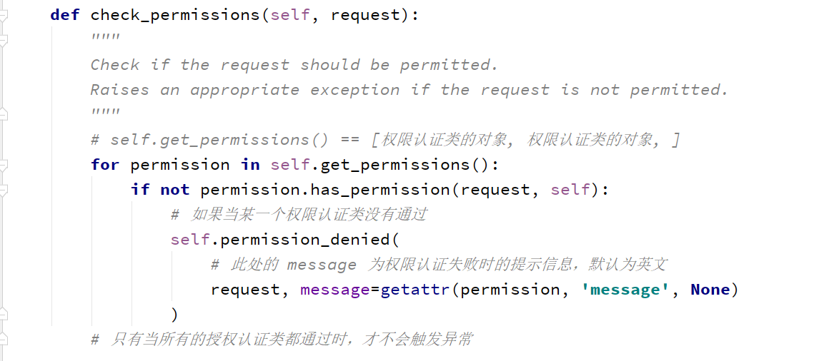

### 自定义权限类及源码分析

#### 自定义权限类

~~~
适用场景: 不同视图，需要不同权限进行访问的时候
~~~

~~~python
# 局部使用
from rest_framework.permissions import BasePermission

# class SVIPPermission(object):

# 继承 drf 自带的权限认证类，显得更正规。 必须实现：has_permission方法
class SVIPPermission(BasePermission):
	# 权限认证失败时的提示信息，默认为英文提示 [见图一]
    message = "必须是SVIP才能访问"
    
    def has_permission(self,request,view):
        if request.user.user_type != 3:
            # 表示权限认证未通过
            return False
        # 表示权限认证通过
        return True
	
    # def has_object_permission():  # 验证是否有对某一个对象的操作权限
	# 	pass
    
    
class OrderView(APIView):
    """
	订单相关业务(只有SVIP用户有权限)
	"""
    permission_classes = [SVIPPermission,]

    def get(self,request,*args,**kwargs):
        ...
   

# 全局使用

REST_FRAMEWORK = {
    "DEFAULT_PERMISSION_CLASSES": ['api.utils.permission.SVIPPermission'],
    }

# 全局配置以后，想让某一个视图跳过时，在视图类添加
permission_classes = []
# SVIPPermission 全局配置以后，想让某一个视图接收 VIPPermission 授权验证时
permission_classes = [VIPPermission, ]
~~~

#### 源码分析

~~~python
# 源码路径  has_permission() 

self.dispatch() -> initial() -> check_permissions() -> has_permission() 

~~~

~~~python
# has_object_permission

GenericAPIView.get_object  -->  check_object_permissions  -->  has_object_permission
~~~

