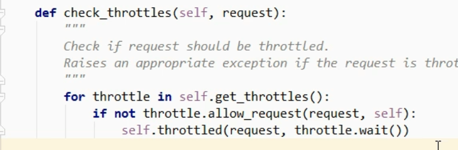

### 节流自定义实现及源码分析

~~~python
问题: 访问频率控制

# 通过限制某一个 ip 或 username 的访问频次来实现节流
~~~

#### 匿名用户： 通过 ip 进行控制 [自己写实现的代码]

~~~python
## 局部配置

import time

# 所有用户的 历史访问记录     {[], [], []...}
VISIT_RECORD = {}

from rest_framework.throttling import BaseThrottle, SimpleRateThrottle

# class VisitThrottle(object):
* class VisitThrottle(BaseThrottle):
    """60s内只能访问3次"""

    def __init__(self):
        # 某一个用户访问记录
        self.history = None

	def allow_request(self,request,view):
        # 1. 获取用户IP
        # remote_addr = request.META.get('REMOTE_ADDR')
        * remote_addr = self.get_ident(request)  # 继承BaseThrottle时，获取 ip
        ctime = time.time()
        # 如果该 ip 为第一次访问
        if remote_addr not in VISIT_RECORD:
            VISIT_RECORD[remote_addr] = [ctime,]
            return True
        
        # 获取到该 ip 的历史访问记录
        history = VISIT_RECORD.get(remote_addr)
        self.history = history

        # 将该 ip 的过期历史访问记录删除
        while history and history[-1] < ctime - 60:
            history.pop()

        # 如果该 ip 的有效历史访问记录次数 < 3
        if len(history) < 3:
			history.insert(0,ctime)
            return True

      
        # return True    # 表示可以继续访问
	    # return False # 表示访问频率太高，被限制

	def wait(self):
        """
		在提示的信息中，添加数据: 还需要等多少秒才能访问
		"""
        ctime = time.time()
        return 60 - (ctime - self.history[-1])

class AuthView(APIView):

    throttle_classes = [VisitThrottle,]

    def post(self,request,*args,**kwargs):
        ...
~~~

~~~python
## 全局配置

REST_FRAMEWORK = {
    "DEFAULT_THROTTLE_CLASSES": ["api.utils.throttle.VisitThrottle"],
}
~~~

###### 以下两种通常结合使用

#### 匿名用户： 通过 ip 进行控制 [继承 SimpleRateThrottle ]

~~~python
from rest_framework.throttling import BaseThrottle, SimpleRateThrottle

class VisitThrottle(SimpleRateThrottle):
    scope = "Luffy"

    def get_cache_key(self, request, view):
        return self.get_ident(request)  # 获取 ip
    
# settings.py
"DEFAULT_THROTTLE_RATES": {
    "Luffy": '3/m',  # 每分钟3次
}
~~~

#### 登录用户： 通过 username 进行控制 [继承 SimpleRateThrottle ]

~~~python
class UserThrottle(SimpleRateThrottle):
    scope = "LuffyUser"

    def get_cache_key(self, request, view):
        # 将用户唯一标识放到缓存
        return request.user.username  # 通过用户名来
    
# settings.py
"DEFAULT_THROTTLE_RATES": {
	"LuffyUser": '10/m',
}
~~~

~~~python
## 将使用 username节流 作为全局配置

REST_FRAMEWORK = {
    "DEFAULT_THROTTLE_CLASSES": ["api.utils.throttle.UserThrottle"],
}
"DEFAULT_THROTTLE_RATES": {
    "Luffy": '3/m',
    "LuffyUser": '10/m',
}

# 注意: 只有登录、注册视图 使用 ip 节流
throttle_classes = [VisitThrottle,]
~~~

#### 源码分析

~~~python
# 源码路径

self.dispatch() -> initial() -> check_throttles() -> allow_request()
~~~

##### 样例： autofull 项目实现

~~~python
#  settings.py

'DEFAULT_THROTTLE_CLASSES': [
    # 配置视图访问频次
    'rest_framework.throttling.ScopedRateThrottle',
],

'DEFAULT_THROTTLE_RATES': {
    # 配置匿名用户访问频次
    'anon': '10/m',
    # 配置认证用户访问频次
    'user': '10/m',
    # 配置检查类接口访问频次
    'chk': '20/m',
    # 配置特定接口访问频次
    'email': '1/m',
    # 配置管理员
    'admin': '50/m'
}
  

# veiws.py
class UserCreate(APIView):
    """用户注册视图"""
    
    throttle_scope = 'anon'
	... 

~~~

