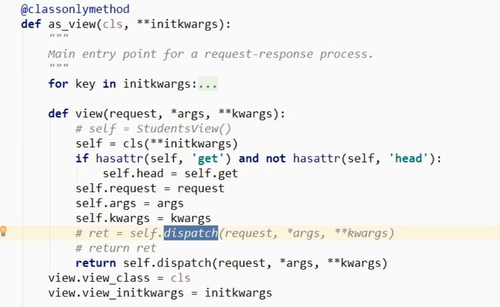
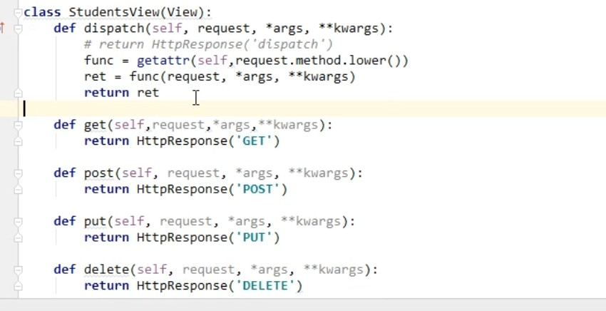
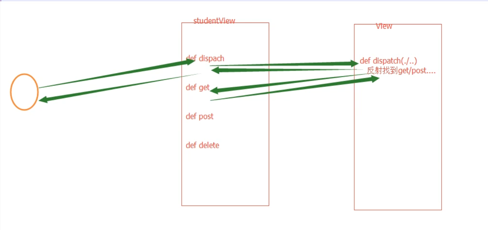

####  CBV请求之dispatch方法原理及请求流程

~~~
基于反射实现 根据请求方法不同，执行不同的响应方法。

原理：url -> view方法 -> dispatch方法（反射执行其他：GET/POST/DELETE/PUT...）
~~~

1. view方法 分析

  

2. dispatch 方法逻辑解析（基于反射）
    
~~~python 
# 同样可以调用父类的 dispatch 方法
class StudentsView(View):
    def dispatch(self, request, *args, **kwargs):
        print('before')
        # 执行父类的dispatch方法
        ret=super(StudentsView,self).dispatch(request, *args, **kwargs)
        print('after')
        return ret  # 假使请求为 get请求， 则 ret = HttpResponse('GET')
    
    def get(self,request,*args,**kwargs):
        return HttpResponse('GET')

    def post(self, request, *args, **kwargs):
        return HttpResponse('POST')

    def put(self, request, *args, **kwargs):
        return HttpResponse('PUT')

    def delete(self, request, *args, **kwargs):
        return HttpResponse('DELETE')
    
~~~
2. CBV模式请求流程

   