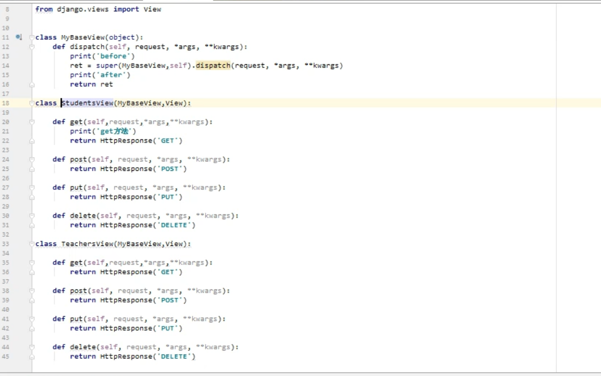

#### CBV之通过继承实现多个类公用的功能

~~~
通过继承实现 多个类共用的功能 (可以避免代码的重复编写)
~~~

~~~python
# 代码实现 (类似于装饰器)
from django.views import View

class MyBaseView(object):
	def dispatch(self, request, *args, **kwargs):
		print('before')
        # 注意super不一定是去找MyBaseView的父类中的方法
        # 可能是去 self-->StudentsView 的第二个父类 View 中去找
		ret = super(MyBaseView,self).dispatch(request, *args, **kwargs)
		print('after')
		return ret

class StudentsView(MyBaseView,View):

	def get(self,request,*args,**kwargs):
		print('get方法')
		return HttpResponse('GET')

	def post(self, request, *args, **kwargs):
		return HttpResponse('POST')

	def put(self, request, *args, **kwargs):
		return HttpResponse('PUT')

	def delete(self, request, *args, **kwargs):
		return HttpResponse('DELETE')

~~~

