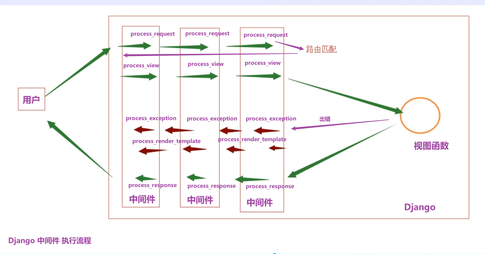
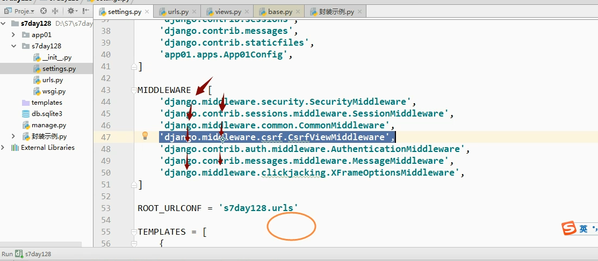
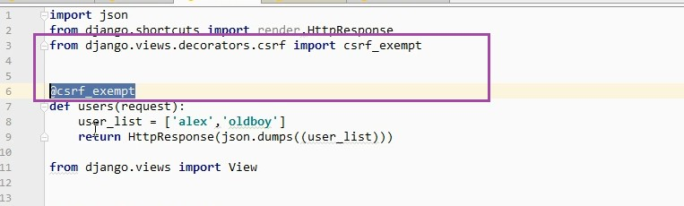

#### 中间件及FBV的csrf

1. 中间件最多可以写5个方法 

   ~~~python
   - process_request # 生成请求对象后，路由匹配之前
   - process_view  # 路由匹配后，视图函数调用之前
   - process_response  # 视图函数执行后，响应内容返回浏览器之前
   - process_exception  # 视图函数发生异常时
   - process_render_template
   ~~~

2. 中间件执行流程

   
   
   

3. 中间件可以做什么

   ~~~python
   # 中间件适用于 对所有的请求做批量的操作时
   # 对单个请求做操作时，可以用 装饰器
   
   1.  基于角色的权限控制
   2.  用户登录验证
   3.  django的csrf是如何实现？ [原理]
   	 在process_view方法中判断用户请求是否合法
   	 	为什么是process_view而不是process_request:因为判断用户是否合法时，还要判断用户请求的视图		  接口是否已经被免除csrf认证(即是否需要判断用户合法)
       - 检查视图是否被 @csrf_exempt （免除csrf认证）
       - 去请求体或cookie中获取token
   4.  session	 [原理]
   # 看源码
   from django.contrib.sessions.middleware import SessionMiddleware
   
   5.  黑名单
   6.  日志记录
   ~~~
4. 全局限制时，免除单个接口的csrf认证

   

5. csrf使用情况

   ~~~python
   情况一：
   MIDDLEWARE = [
       'django.middleware.security.SecurityMiddleware',
       'django.contrib.sessions.middleware.SessionMiddleware',
       'django.middleware.common.CommonMiddleware',
       'django.middleware.csrf.CsrfViewMiddleware', # 全站使用csrf认证
       'django.contrib.auth.middleware.AuthenticationMiddleware',
       'django.contrib.messages.middleware.MessageMiddleware',
       'django.middleware.clickjacking.XFrameOptionsMiddleware',
   ]
   
   
   from django.views.decorators.csrf import csrf_exempt
   @csrf_exempt # 该函数无需认证
   def users(request):
       user_list = ['alex','oldboy']
       return HttpResponse(json.dumps((user_list)))
   
   情况二：
   MIDDLEWARE = [
       'django.middleware.security.SecurityMiddleware',
       'django.contrib.sessions.middleware.SessionMiddleware',
       'django.middleware.common.CommonMiddleware',
       #'django.middleware.csrf.CsrfViewMiddleware', # 全站不使用csrf认证
       'django.contrib.auth.middleware.AuthenticationMiddleware',
       'django.contrib.messages.middleware.MessageMiddleware',
       'django.middleware.clickjacking.XFrameOptionsMiddleware',
   ]
   
   
   from django.views.decorators.csrf import csrf_protect
   @csrf_protect # 该函数需认证
   def users(request):
       user_list = ['alex','oldboy']
       return HttpResponse(json.dumps((user_list)))
   ~~~

   