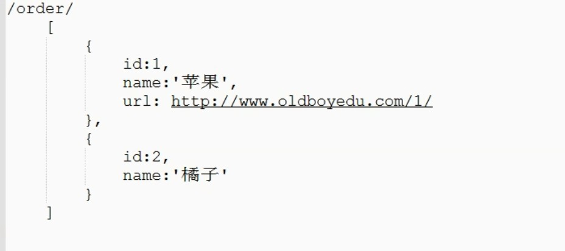

#### RESTful API设计

1. API与用户的通信协议，总是使用 HTTPS 协议

2. 域名

   ~~~python
   * https://api.example.com     尽量将API部署在专用域名（会存在跨域问题）
   * https://example.org/api/    API很简单
   ~~~

3. 版本

   ~~~python
   * URL，如：https://api.example.com/v1/
   * 请求头     跨域时，引发发送多次请求
   ~~~

4. 路径, 视网络上任何东西都是资源， 均使用名词表示(可复数)

   ~~~python
   * https://api.example.com/v1/zoos
   * https://api.example.com/v1/animals
   * https://api.example.com/v1/employees
   ~~~

5. method

   ~~~python
   * GET      ：从服务器取出资源（一项或多项）
   * POST     ：在服务器新建一个资源
   * PUT      ：在服务器更新资源（客户端提供改变后的完整资源）
   * PATCH    ：在服务器更新资源（客户端提供改变后的部分资源-->修改一个记录的部分信息）
   * DELETE   ：从服务器删除资源
   ~~~

6. 过滤， 通过在url上传参的形式传递搜索条件

   ~~~python
   * https://api.example.com/v1/zoos?limit=10：指定返回记录的数量
   * https://api.example.com/v1/zoos?offset=10：指定返回记录的开始位置
   * https://api.example.com/v1/zoos?page=2&per_page=100：指定第几页，以及每页的记录数
   * https://api.example.com/v1/zoos?sortby=name&order=asc：指定返回结果按照哪个属性排序，以及排序顺序
   * https://api.example.com/v1/zoos?animal_type_id=1：指定筛选条件
   ~~~

7. 状态码 + code

   ~~~
   开发之前询问前端开发者对 状态码+code 有没有要求
   ~~~

   ~~~python
   200 OK - [GET]：服务器成功返回用户请求的数据，该操作是幂等的（Idempotent）。
   201 CREATED - [POST/PUT/PATCH]：用户新建或修改数据成功。
   202 Accepted - [*]：表示一个请求已经进入后台排队（异步任务）
   204 NO CONTENT - [DELETE]：用户删除数据成功。
   400 INVALID REQUEST - [POST/PUT/PATCH]：用户发出的请求有错误，服务器没有进行新建或修改数据的操作，该操作是幂等的。
   401 Unauthorized - [*]：表示用户没有权限（令牌、用户名、密码错误）。
   403 Forbidden - [*] 表示用户得到授权（与401错误相对），但是访问是被禁止的。
   404 NOT FOUND - [*]：用户发出的请求针对的是不存在的记录，服务器没有进行操作，该操作是幂等的。
   406 Not Acceptable - [GET]：用户请求的格式不可得（比如用户请求JSON格式，但是只有XML格式）。
   410 Gone -[GET]：用户请求的资源被永久删除，且不会再得到的。
   422 Unprocesable entity - [POST/PUT/PATCH] 当创建一个对象时，发生一个验证错误。
   500 INTERNAL SERVER ERROR - [*]：服务器发生错误，用户将无法判断发出的请求是否成功。
   
   更多看这里：http://www.w3.org/Protocols/rfc2616/rfc2616-sec10.html
   ~~~

8. 错误处理， 状态码是 4xx 时，应返回错误信息， 

   ~~~python
   {
       error: "Invalid API key"
   }
   ~~~

9. 返回结果，针对不同操作，服务器向用户返回的结果应该符合以下规范。

   ~~~python
   GET /collection：返回资源对象的列表（数组）
   GET /collection/resource：返回单个资源对象
   POST /collection：返回新生成的资源对象
   PUT /collection/resource：返回完整的资源对象
   PATCH /collection/resource：返回完整的资源对象
   DELETE /collection/resource：返回一个空文档
   ~~~

10. Hypermedia API，RESTful API最好做到Hypermedia，即返回结果中提供链接（用户查看更详细的信息），连向其他API方法，使得用户不查文档，也知道下一步应该做什么。

    ~~~python
    {"link": {
      "rel":   "collection https://www.example.com/zoos",
      "href":  "https://api.example.com/zoos",
      "title": "List of zoos",
      "type":  "application/vnd.yourformat+json"
    }}
    ~~~

    

##### 友情链接

[Django Rest Framework](https://www.cnblogs.com/wupeiqi/articles/7805382.html)